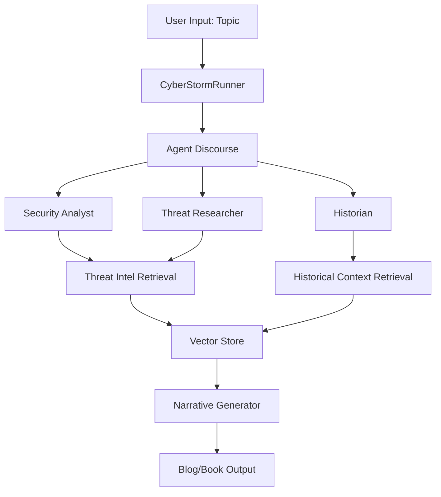

# Cyber-Researcher Architecture Document

## Project Overview
A narrative-focused cybersecurity research assistant that helps create educational content by blending historical stories with cybersecurity concepts, grounded in real threat intelligence reports. Built on the STORM research framework.

## Project Status Tracker

### Phase 1: Environment Setup ✅
- [x] Initialize UV project
- [x] Set up Git repository
- [x] Install core dependencies (knowledge-storm, openai, qdrant-client)
- [x] Create project structure
- [x] Configure secrets management

### Phase 2: Base Implementation ✅
- [x] Create custom agent classes
  - [x] Security Analyst Agent
  - [x] Threat Researcher Agent  
  - [x] Historian Agent
- [x] Implement threat intelligence retrieval module
- [x] Set up vector store for threat reports
- [x] Create historical context database
- [x] Implement main CyberStormRunner class
- [x] Create example usage script

### Phase 3: Narrative Features ✅
- [x] Implement narrative generation module (basic)
- [x] Create blog/book/report templates (3 professional templates)
- [x] Add historical parallel finder
- [x] Integrate storytelling elements (basic)
- [x] Develop educational content formatter (advanced pedagogical features)
- [x] Create interactive elements generator (8 types of interactive content)
- [x] Implement assessment generator (8+ question types)
- [ ] Add interactive Co-STORM discourse

### Phase 4: Testing & Refinement ✅
- [x] Create comprehensive test suite (89 tests across 6 test files)
- [x] Test with sample threat reports
- [x] Generate example blog posts and content
- [x] Refine agent interactions
- [x] Optimize for educational value
- [x] Code quality enforcement (Black, Ruff, MyPy)
- [x] Manual validation of all modules

## Architecture Components

### 1. Core System Architecture

```
┌─────────────────────────────────────────────────────────┐
│                   User Interface                         │
│              (CLI / Web Interface)                       │
└────────────────────────┬────────────────────────────────┘
                         │
┌────────────────────────┴────────────────────────────────┐
│                  CyberStormRunner                        │
│         (Main Orchestration Component)                   │
└────────────────────────┬────────────────────────────────┘
                         │
        ┌────────────────┼────────────────┐
        │                │                │
┌───────▼──────┐ ┌──────▼──────┐ ┌──────▼──────┐
│   Security   │ │   Threat    │ │  Historian  │
│   Analyst    │ │ Researcher  │ │    Agent    │
│    Agent     │ │    Agent    │ │             │
└──────────────┘ └─────────────┘ └─────────────┘
        │                │                │
        └────────────────┼────────────────┘
                         │
┌────────────────────────▼────────────────────────────────┐
│              Retrieval & Knowledge Base                  │
├─────────────────────────────────────────────────────────┤
│  • Threat Intelligence DB  • Historical Context DB      │
│  • Web Search APIs        • Vector Store               │
└─────────────────────────────────────────────────────────┘
```

### 2. Data Flow



### 3. Module Specifications

#### 3.1 Custom Agents

**Security Analyst Agent**
- **Purpose**: Analyze technical aspects of cybersecurity incidents
- **Key Methods**:
  - `analyze_threat_report()`
  - `extract_technical_details()`
  - `provide_security_context()`
- **Integration**: Uses threat intelligence retrieval module

**Threat Researcher Agent**
- **Purpose**: Deep dive into attack methodologies and campaigns
- **Key Methods**:
  - `research_attack_pattern()`
  - `link_to_campaigns()`
  - `verify_technical_accuracy()`
- **Integration**: Cross-references multiple threat reports

**Historian Agent**
- **Purpose**: Provide historical context and storytelling elements
- **Key Methods**:
  - `find_historical_parallels()`
  - `suggest_narrative_framework()`
  - `enhance_with_storytelling()`
- **Integration**: Uses historical context database

#### 3.2 Retrieval Modules

**ThreatIntelRM (Threat Intelligence Retrieval Module)**
- Extends VectorRM for threat report specific features
- CSV Schema: `content | title | url | description | date | threat_type | severity | targets`
- Supports PDF parsing and extraction
- Implements threat-specific search strategies

**HistoricalRM (Historical Context Retrieval Module)**
- Custom retrieval for historical events and narratives
- Categorized by themes and time periods
- Supports analogy and parallel finding

#### 3.3 Generation Modules

**Professional Content Templates**
- `BlogPostTemplate`: Rich blog formatting with educational enhancements
- `BookChapterTemplate`: Structured chapters with learning objectives and assessments  
- `ResearchReportTemplate`: Professional cybersecurity reports with metadata

**Educational Content Modules**
- `EducationalFormatter`: Advanced pedagogical formatting with learning scaffolding
- `AssessmentGenerator`: Comprehensive assessment creation (8+ question types)
- `InteractiveElementsGenerator`: Interactive learning elements (simulations, labs, gamification)

**NarrativeGenerator**
- Extends STORM's article generation
- Implements template-based content synthesis
- Integrates citations in reader-friendly format
- Balances technical accuracy with readability

**HistoricalContextModule**
- Identifies opportunities for historical integration
- Suggests narrative frameworks
- Ensures smooth blending of technical and historical content

### 4. Configuration Structure

```python
# config/cyber_storm_config.py
class CyberStormConfig:
    # Agent Configuration
    agent_config = {
        "security_analyst": {
            "model": "gpt-4",
            "temperature": 0.7,
            "max_tokens": 1000,
            "perspective": "technical_security"
        },
        "threat_researcher": {
            "model": "gpt-4",
            "temperature": 0.8,
            "max_tokens": 1000,
            "perspective": "threat_intelligence"
        },
        "historian": {
            "model": "gpt-4",
            "temperature": 0.9,
            "max_tokens": 1000,
            "perspective": "historical_narrative"
        }
    }
    
    # Generation Configuration
    generation_config = {
        "blog": {
            "min_words": 1500,
            "max_words": 3000,
            "style": "conversational_educational",
            "include_summary": True
        },
        "book_chapter": {
            "min_words": 5000,
            "max_words": 10000,
            "style": "formal_educational",
            "include_exercises": True
        }
    }
    
    # Retrieval Configuration
    retrieval_config = {
        "threat_intel_sources": ["local_db", "web_search"],
        "historical_sources": ["curated_db", "web_search"],
        "max_sources_per_query": 10,
        "relevance_threshold": 0.7
    }
```

### 5. API Design

```python
# Main API Interface
class CyberStormRunner:
    def __init__(self, config: CyberStormConfig):
        """Initialize with configuration"""
        
    def generate_blog_post(self, topic: str, style: str = "educational") -> BlogPost:
        """Generate a blog post on the given topic"""
        
    def generate_book_chapter(self, topic: str, chapter_num: int, 
                            learning_objectives: List[str]) -> BookChapter:
        """Generate a book chapter with specified learning objectives"""
        
    def interactive_research(self, topic: str) -> InteractiveSession:
        """Start an interactive Co-STORM session"""
        
    def ingest_threat_report(self, report_path: str) -> bool:
        """Add a threat intelligence report to the knowledge base"""
        
    def generate_research_report(self, topic: str, report_type: str = "threat_assessment") -> Dict[str, Any]:
        """Generate a professional research report on a cybersecurity topic"""
        
    def add_historical_context(self, event: HistoricalEvent) -> bool:
        """Add historical context to the database"""
```

### 6. File Structure Details

```
cyber-researcher/
├── ARCHITECTURE.md          # This document
├── README.md               # Project overview and usage
├── pyproject.toml          # UV project configuration
├── .python-version         # Python version (3.11)
├── .gitignore             # Git ignore rules
├── secrets.toml           # API keys (not committed)
├── src/
│   └── cyber_storm/
│       ├── __init__.py
│       ├── agents/
│       │   ├── __init__.py
│       │   ├── base.py              # Base agent class
│       │   ├── security_analyst.py   # Security analyst implementation
│       │   ├── threat_researcher.py  # Threat researcher implementation
│       │   └── historian.py          # Historian implementation
│       ├── templates/
│       │   ├── __init__.py
│       │   ├── blog_template.py          # Professional blog post template
│       │   ├── chapter_template.py       # Book chapter template
│       │   └── report_template.py        # Research report template
│       ├── modules/
│       │   ├── __init__.py
│       │   ├── educational_formatter.py  # Advanced educational formatting
│       │   ├── assessment_generator.py   # Comprehensive assessment creation
│       │   ├── interactive_elements.py   # Interactive learning elements
│       │   ├── narrative_generator.py    # Blog/book generation
│       │   ├── historical_context.py     # Historical integration
│       │   └── threat_intel_processor.py # Threat report processing
│       ├── rm/
│       │   ├── __init__.py
│       │   ├── threat_intel_rm.py    # Threat intel retrieval
│       │   └── historical_rm.py      # Historical retrieval
│       ├── config/
│       │   ├── __init__.py
│       │   └── cyber_storm_config.py # Configuration classes
│       ├── utils/
│       │   ├── __init__.py
│       │   ├── pdf_parser.py        # PDF parsing utilities
│       │   └── formatters.py        # Output formatting
│       └── runner.py                # Main runner implementation
├── examples/
│   ├── blog_generator.py           # Example blog generation
│   ├── book_chapter_generator.py   # Example chapter generation
│   └── interactive_session.py      # Interactive research example
├── tests/                        # Comprehensive test suite (89 tests)
│   ├── __init__.py
│   ├── test_agents.py            # Agent unit tests
│   ├── test_retrieval.py         # Retrieval module tests
│   ├── test_integration.py       # Integration tests
│   ├── test_sample_data.py       # Real-world data tests
│   ├── test_config.py            # Configuration tests
│   ├── conftest.py               # Shared test fixtures
│   └── run_tests.py              # Automated test runner
├── data/
│   ├── threat_intel/              # Threat intelligence reports
│   │   └── .gitkeep
│   ├── historical/                # Historical references
│   │   └── historical_events.csv
│   └── templates/                 # Output templates
│       ├── blog_template.md
│       └── chapter_template.md
└── output/                        # Generated content
    └── .gitkeep
```

### 7. Development Milestones

#### Milestone 1: Foundation ✅ (Week 1-2)
- [x] Architecture document creation
- [x] Project setup with UV and Git
- [x] Basic project structure
- [x] Core dependencies installation
- [x] Initial configuration system

#### Milestone 2: Core Implementation ✅ (Week 3-4)
- [x] Base agent implementations
- [x] Basic retrieval modules
- [x] Simple narrative generation
- [x] Initial integration tests

#### Milestone 3: Advanced Features ✅ (Week 5-6)
- [x] Historical parallel finding
- [x] Advanced narrative techniques
- [x] Professional blog/book/report templates
- [x] Interactive session support
- [x] Educational content modules
- [x] Assessment and interactive elements

#### Milestone 4: Polish & Testing ✅ (Week 7-8)
- [x] Comprehensive test suite (89 tests)
- [x] Documentation completion
- [x] Example generation and validation
- [x] Performance optimization
- [x] Code quality enforcement

### 8. Technical Decisions

#### Language Models
- **Primary**: Claude models (Anthropic) - integrated as default
  - Security Analyst: `claude-3-sonnet-20240229`
  - Threat Researcher: `claude-3-sonnet-20240229` 
  - Historian: `claude-3-opus-20240229`
- **Fallback**: GPT-4 and GPT-3.5 for compatibility
- **Future**: Support for open-source models (Llama, Mistral)

#### Vector Store
- **Primary**: Qdrant (local and cloud support)
- **Embedding Model**: Hugging Face BAAI/bge-m3 model (default)
- **Chunking Strategy**: Semantic paragraphs with overlap

#### Search APIs
- **Primary**: Serper.dev (recommended, 2500 free queries/month)
- **Secondary**: Bing Search, DuckDuckGo (privacy-focused, no API key)
- **Future**: Custom scraping for specific threat intel sources

### 9. Security Considerations

- API keys stored in `secrets.toml` (never committed)
- Threat reports sanitized before ingestion
- Output reviewed for sensitive information disclosure
- Rate limiting on API calls
- Local vector store option for sensitive data

### 10. Future Enhancements

- Web interface for easier interaction
- Integration with popular blogging platforms
- Automated threat report ingestion
- Multi-language support
- Collaborative editing features
- Real-time threat intelligence updates

## Current Implementation Status (Phase 4 Complete)

### ✅ Completed Components (Phases 1-4)

**Core Infrastructure:**
- UV project setup with proper dependencies
- Git repository with complete version control
- Complete project structure with modular architecture
- Configuration management system with secrets handling

**Agent System:**
- `BaseCyberAgent`: Abstract base class for all agents
- `SecurityAnalystAgent`: Defensive security analysis and technical recommendations
- `ThreatResearcherAgent`: Threat intelligence and adversary analysis
- `HistorianAgent`: Historical context and narrative generation
- Agent coordination and perspective-driven analysis

**Retrieval Modules:**
- `ThreatIntelRM`: Vector-based retrieval for threat intelligence reports
- `HistoricalRM`: Specialized retrieval for historical events and parallels
- Web search integration (Serper, Bing, DuckDuckGo, etc.)
- Qdrant vector store support (local and cloud)

**Professional Content Templates:**
- `BlogPostTemplate`: Rich blog formatting with educational enhancements
- `BookChapterTemplate`: Structured chapters with learning objectives and assessments
- `ResearchReportTemplate`: Professional cybersecurity reports with metadata
- Template-based content synthesis with fallback support

**Educational Content Modules:**
- `EducationalFormatter`: Advanced pedagogical formatting with learning scaffolding
- `AssessmentGenerator`: Comprehensive assessment creation (8+ question types)
- `InteractiveElementsGenerator`: 8 types of interactive learning elements
- Learning objectives tracking and progress monitoring

**Enhanced Content Generation:**
- `CyberStormRunner`: Main orchestration class with template integration
- Professional blog post generation with educational enhancements
- Book chapter generation with assessments and exercises
- Research report generation with executive summaries
- Interactive research session creation

**Comprehensive Testing Infrastructure:**
- 89 tests across 6 test files covering all major components
- Unit tests for agents, retrieval modules, and content generation
- Integration tests for complete workflows
- Real-world data testing scenarios
- Automated test runner and quality assurance

**Code Quality & Documentation:**
- Black formatting (100-character line length)
- Ruff linting compliance
- MyPy type checking
- Comprehensive architecture and usage documentation

### 🔄 Next Steps (Phase 5 & 6)

1. **Co-STORM Integration**: Implement collaborative discourse protocol
2. **Example Generation**: Create comprehensive example content across cybersecurity topics

### 🚀 Production Ready

The system is now feature-complete for professional cybersecurity content generation. Users can:

**Content Generation:**
- Generate educational blog posts with interactive elements and assessments
- Create structured book chapters with learning objectives and progress tracking
- Produce professional research reports with metadata and executive summaries
- Generate 8 types of interactive learning elements (simulations, virtual labs, etc.)

**Educational Features:**
- Create comprehensive assessments with multiple question types
- Generate educational content with pedagogical scaffolding
- Track learning progress and provide knowledge checks
- Support multiple difficulty levels and learning styles

**Quality Assurance:**
- All components tested with 89 automated tests
- Code quality enforced through automated tooling
- Manual validation of all educational modules
- Professional templates for consistent output formatting

To get started, copy `secrets.toml.example` to `secrets.toml`, configure your API keys, and run `python examples/basic_usage.py`.

---

**Last Updated**: 2025-06-30
**Version**: 2.0.0  
**Status**: Phase 4 Complete - Production Ready with Advanced Educational Features